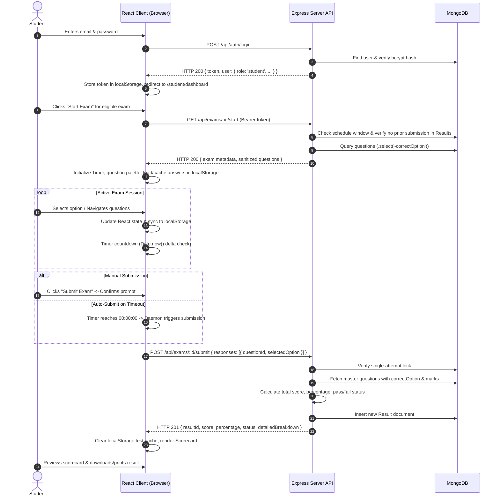
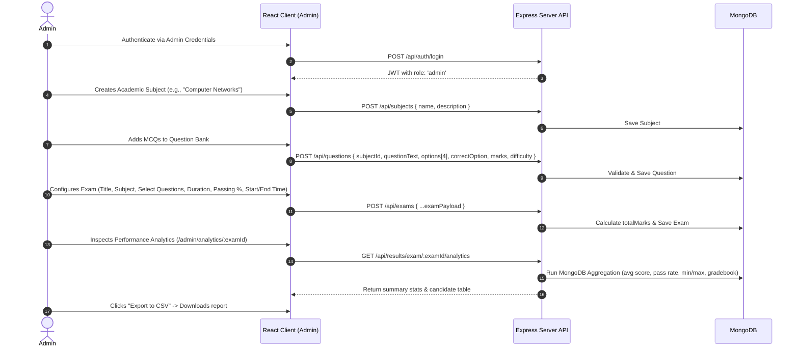
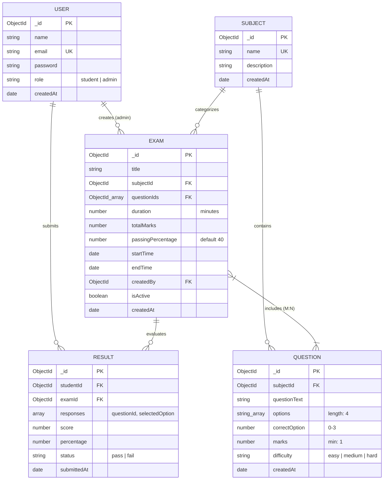

# Product Requirements Document (PRD)
## Online Examination System (MERN Stack)
**Academic Project Reference:** BCSP-064 (IGNOU BCA Capstone)  
**Document Version:** 1.0.0  
**Target Stack:** MongoDB, Express.js, React.js (Vite + Tailwind CSS), Node.js  
**Status:** Approved for Implementation  

---

## 1. Executive Summary & Objective

The **Online Examination System** is a full-stack web application designed to digitize, streamline, and secure the administration of objective (multiple-choice) academic assessments. It addresses the fundamental bottlenecks of conventional pen-and-paper testing—administrative printing costs, question paper leakage risks, delayed manual grading, invigilation disparities, and lack of performance analytics.

### Primary Objectives
- **Secure Role-Based Access:** Role-based access control (RBAC) separating **Administrators** (instructors/examiners) and **Students** (candidates) using bcrypt password hashing and stateless JSON Web Tokens (JWT).
- **Curriculum & Question Bank Management:** Hierarchical structure of subjects and a centralized repository of 4-option Multiple Choice Questions (MCQs) with difficulty tagging and marks allocation.
- **Exam Scheduling & Time-Window Enforcement:** Configurable assessments with scheduled start/end dates, strict duration limits, and automated access control.
- **Tamper-Proof Synchronized Test Engine:** Real-time countdown timer with epoch delta tracking (resilient to browser tab throttling), question palette navigation, client-side answer caching in `localStorage`, and an automated auto-submission daemon on timeout.
- **Server-Side Grading & Answer Concealment:** Question delivery API strictly omits `correctOption` to prevent client-side DevTools inspection. Automated evaluation executes strictly on the server upon submission.
- **Instant Result & Comprehensive Analytics:** Immediate generation of detailed scorecards for students and administrative performance dashboards (KPIs, score distributions, searchable student gradebooks, and CSV export).

---

## 2. User Personas & Permissions

| Persona | Role | Primary Goals & Capabilities |
| :--- | :--- | :--- |
| **Institutional Admin / Faculty** | `admin` | - Manage academic subjects and courses.<br>- Create, edit, filter, and delete MCQs in Question Bank.<br>- Configure and schedule examinations with custom marks and windows.<br>- Monitor student rosters and review exam performance analytics.<br>- Export gradebook data to CSV. |
| **Student / Candidate** | `student` | - Self-register and securely log into the student portal.<br>- View upcoming, active, and completed examinations.<br>- Take timed tests with live countdown, question palette, and instant status.<br>- Auto-save answer selections with local storage persistence on reload.<br>- Receive instantaneous evaluation scorecard and review answers. |

---

## 3. System Architecture & High-Level Design

The application follows a decoupled **Three-Tier Client-Server Architecture**:

```mermaid
graph TD
    subgraph Presentation Tier [Client Layer - React.js + Tailwind CSS + Vite]
        UI_Auth[Login / Register]
        UI_Admin[Admin Dashboard & Analytics]
        UI_QBank[Subject & Question Bank]
        UI_ExamConfig[Exam Scheduler]
        UI_Student[Student Dashboard]
        UI_TestEngine[Live Timed Test Engine]
        UI_Scorecard[Scorecard & Review]
    end

    subgraph Application Tier [Server Layer - Node.js + Express.js REST API]
        MW_Auth[JWT & Role Guard Middleware]
        Ctrl_Auth[Auth Controller]
        Ctrl_Subject[Subject Controller]
        Ctrl_Question[Question Controller]
        Ctrl_Exam[Exam Controller]
        Ctrl_Result[Result & Evaluation Engine]
    end

    subgraph Data Tier [Database Layer - MongoDB Atlas / Community]
        DB_Users[(Users Collection)]
        DB_Subjects[(Subjects Collection)]
        DB_Questions[(Questions Collection)]
        DB_Exams[(Exams Collection)]
        DB_Results[(Results Collection)]
    end

    Presentation Tier -->|HTTPS / REST API + Bearer JWT| Application Tier
    Application Tier -->|Mongoose ODM / Validation| Data Tier
```

---

## 4. End-to-End User Flows

### 4.1 Student Test-Taking & Submission Lifecycle



### 4.2 Administrator Exam Setup & Grading Audit Lifecycle



---

## 5. Functional Requirements (FR)

### Module 1: Authentication & Authorization (FR-1 to FR-3, FR-10 to FR-11)
- **FR-1 Admin Authentication:** Authenticate admin using email and bcrypt password. Issue JWT with `{ id, role: 'admin', name }`.
- **FR-10 Candidate Registration:** Allow student self-registration with `name`, `email`, `password` (min 6 chars), and default role `'student'`. Email must be validated, lowercased, and unique.
- **FR-11 Student Authentication:** Authenticate student credentials, issue JWT with `{ id, role: 'student', name }`.
- **FR-Auth-Guard:** Client and server-side route protection. Unauthorized requests return HTTP 401; non-admin accessing admin routes returns HTTP 403.

### Module 2: Subject Management (FR-2, FR-Subject-Cascade)
- **FR-2 Subject CRUD:** Admins can Create, Read, Update, and Delete academic subjects (`name`, `description`).
- **FR-Subject-Cascade:** Cascade safeguard preventing deletion of a subject if questions exist linked to that subject.

### Module 3: Question Bank Management (FR-3, FR-Q-Filter)
- **FR-3 Question CRUD:** Manage MCQs containing:
  - Subject foreign reference (`subjectId`).
  - Question statement (`questionText`).
  - Exactly 4 options (`options` array of 4 strings).
  - Zero-based correct index (`correctOption` in range 0–3).
  - Marks weightage (positive integer, default 1).
  - Difficulty rating (`'easy'`, `'medium'`, `'hard'`).
- **FR-Q-Filter:** Filter question bank by Subject and Difficulty level with total question counts.

### Module 4: Exam Configuration & Scheduling (FR-4, FR-5, FR-9)
- **FR-4 Exam Configuration:** Admins configure exam title, linked subject, question selection (multi-select), duration (minutes), passing percentage (default 40%), and auto-calculated total marks.
- **FR-5 Calendar Window Scheduling:** Enforce active start time (`startTime`) and end time (`endTime`). Start time must precede end time.
- **FR-9 Exam Activation Toggle:** Ability to activate/deactivate exams (`isActive`).

### Module 5: Candidate Portal & Dashboard (FR-6, FR-12, FR-13)
- **FR-6 Candidate Directory:** Admin can view registered student rosters with enrolment/registration timestamps.
- **FR-12 Student Dashboard:** Categorized listing of:
  - **Live Exams:** Currently within start-end window and not yet attempted.
  - **Upcoming Exams:** Scheduled for future dates.
  - **Completed Exams:** Previously attempted, with quick links to view scorecards.
- **FR-13 Schedule Guard:** "Start Exam" disabled if outside active window or already submitted.

### Module 6: Live Timed Test Engine (FR-14 to FR-17, FR-20)
- **FR-14 Question Presentation & Navigation:**
  - One question displayed at a time with clean, accessible radio selections.
  - Interactive Question Palette showing Answered (Green) vs. Unanswered (Slate).
  - "Previous", "Next", and "Clear Response" controls.
- **FR-15 Synchronized Live Countdown Clock:**
  - Header countdown clock displaying `MM:SS`.
  - Timer calculated using absolute epoch delta (`Date.now() - sessionStart`) to avoid background tab throttling.
  - Visual warning (red text/badge) when remaining time is under 5 minutes.
- **FR-16 Automated Auto-Submit Daemon:**
  - When timer hits `00:00:00`, the client automatically bundles all responses and submits to server without alert freezes.
- **FR-17 Manual Early Submission:**
  - "Submit Exam" button triggers a modal dialog showing total answered vs unanswered questions before confirmation.
- **FR-Reliability (Local Caching):**
  - Candidate selections saved in `localStorage` in real-time. Reloading the browser restores selected choices and elapsed time seamlessly.
- **FR-20 Single-Attempt Enforcement:**
  - Enforced via database check and unique compound index on `{ studentId, examId }`. Prevents multiple attempts or duplicate submissions on double-click.

### Module 7: Evaluation & Scoring Engine (FR-8, FR-18, FR-19)
- **FR-18 Server-Side Evaluation:**
  - Receives payload `responses: [{ questionId, selectedOption }]`.
  - Matches answers against database `correctOption` (unanswered questions marked `-1`).
  - Tallies score, computes percentage to 2 decimal places, assigns `'pass'` or `'fail'`.
- **FR-19 Instant Comprehensive Scorecard:**
  - Returns result immediately with score, total marks, percentage, status, and item-by-item breakdown (Question text, options, candidate answer, correct answer, marks awarded).
  - Clean browser print stylesheet for saving/printing PDF scorecards.

### Module 8: Analytics, Gradebook & Export (FR-7, FR-8)
- **FR-7 & FR-8 Institutional Analytics:**
  - Overview KPI metrics: Total Students, Total Exams, Question Bank Volume, Submissions Count.
  - Exam-specific analytics: Total attempts, Average score, Highest score, Lowest score, Overall pass percentage.
  - Searchable and sortable candidate gradebook table (Name, Enrolment/Email, Marks, Percentage, Status, Submission Date).
  - **CSV Export:** Downloadable gradebook CSV file for departmental records.

---

## 6. Non-Functional Requirements (NFR)

- **NFR-1 Security & Cryptographic Integrity:**
  - Passwords hashed with bcrypt (salt rounds = 10).
  - Stateless authentication via JWT (HMAC-SHA256, 24-hour expiration) in `Authorization: Bearer <token>`.
  - Strict answer key concealment: `.select('-correctOption')` on all student-facing endpoints.
  - Mongoose schema type casting and query sanitization to prevent NoSQL injection.
- **NFR-2 Performance & Concurrency:**
  - Sub-200ms API response time for authentication and exam loading.
  - Non-blocking asynchronous submission handling supporting 100+ concurrent submissions.
- **NFR-3 Usability & Responsive Ergonomics:**
  - WCAG 2.1 Level AA compliant contrast ratio (minimum 4.5:1).
  - Fully responsive layout across mobile (375px), tablet (768px), and desktop (1200px+).
- **NFR-4 Client Resilience & Fault Tolerance:**
  - `localStorage` caching of active answers against browser reloads or network hiccups.
  - Client submit button disabled state (`isSubmitting`) to prevent double-click race conditions.
- **NFR-5 Maintainability & Clean MVC Architecture:**
  - Separation of concerns: Routes, Controllers, Models, Middleware, Client Components, Context Providers.

---

## 7. Database Models & Schema Specifications



### Unique Indexes & Constraints:
1. `users.email`: Unique, lowercase index.
2. `subjects.name`: Unique, trimmed index.
3. `results`: Compound unique index `{ studentId: 1, examId: 1 }` ensuring strict single attempt per student.

---

## 8. RESTful API Endpoint Specifications

### 8.1 Authentication Endpoints (`/api/auth`)
- `POST /api/auth/register` — Register student (`name`, `email`, `password`).
- `POST /api/auth/login` — Authenticate user, return JWT and user profile.
- `GET /api/auth/me` — Return current logged-in user details via Bearer token.

### 8.2 Subject Endpoints (`/api/subjects`)
- `GET /api/subjects` — List all subjects (with question counts).
- `POST /api/subjects` — Create new subject (Admin only).
- `PUT /api/subjects/:id` — Update subject (Admin only).
- `DELETE /api/subjects/:id` — Delete subject (Admin only, checks cascade safety).

### 8.3 Question Bank Endpoints (`/api/questions`)
- `GET /api/questions` — List questions (filter by `subjectId`, `difficulty`) (Admin only).
- `GET /api/questions/:id` — Get single question details (Admin only).
- `POST /api/questions` — Create new MCQ with 4 options & correctOption (Admin only).
- `PUT /api/questions/:id` — Update MCQ (Admin only).
- `DELETE /api/questions/:id` — Delete MCQ (Admin only).

### 8.4 Exam Management Endpoints (`/api/exams`)
- `GET /api/exams` — List all exams (Admin view).
- `GET /api/exams/available` — List active, upcoming, and completed exams for logged-in student.
- `GET /api/exams/:id` — Get exam metadata (Admin / Teacher details).
- `POST /api/exams` — Create and schedule exam (Admin only).
- `PUT /api/exams/:id` — Edit exam or toggle `isActive` (Admin only).
- `DELETE /api/exams/:id` — Delete exam (Admin only).
- `GET /api/exams/:id/start` — Launch exam session. Returns sanitized questions (**excluding `correctOption`**). Validates schedule window and single-attempt constraint.
- `POST /api/exams/:id/submit` — Submit answers, execute server grading, generate and return Result.

### 8.5 Results & Analytics Endpoints (`/api/results`)
- `GET /api/results/my-results` — List all completed exam results for logged-in student.
- `GET /api/results/:id` — Get full result scorecard with item review (Student owner or Admin).
- `GET /api/results/exam/:examId` — Get all candidate results for an exam (Admin only).
- `GET /api/results/exam/:examId/analytics` — Get aggregate stats (average, highest, lowest, pass rate, distribution) (Admin only).
- `GET /api/admin/stats` — High-level dashboard counters (students, exams, questions, submissions) (Admin only).

---

## 9. Frontend Architecture & Screen Layouts

```
client/src/
|-- api/
|   |-- axiosInstance.js       # Axios with JWT Bearer interceptor & 401 handling
|-- context/
|   |-- AuthContext.jsx        # User state, login, register, logout, token management
|-- components/
|   |-- Navbar.jsx             # Role-based header navigation with profile dropdown
|   |-- ProtectedRoute.jsx     # Route guard verifying auth & role ('admin' vs 'student')
|   |-- Timer.jsx              # Synchronized countdown clock with 5-min warning
|   |-- QuestionCard.jsx       # MCQ display with 4 options and radio buttons
|   |-- QuestionNav.jsx        # Question jump grid (palette: answered vs unanswered)
|   |-- ConfirmModal.jsx       # Confirmation modal for exam submission / deletion
|-- pages/
|   |-- Login.jsx              # Split-screen modern login form
|   |-- Register.jsx           # Student self-registration form
|   |-- admin/
|   |   |-- AdminDashboard.jsx # Analytics overview, metric cards, recent submissions
|   |   |-- Subjects.jsx       # Subject catalog table and create/edit modal
|   |   |-- QuestionBank.jsx   # Question filter bar, MCQ cards, create/edit modal
|   |   |-- CreateExam.jsx     # Exam builder with question selector & date pickers
|   |   |-- AdminAnalytics.jsx # Exam score distribution, candidate table & CSV export
|   |-- student/
|   |   |-- StudentDashboard.jsx # Live, Upcoming, Completed assessment cards
|   |   |-- ExamAttempt.jsx      # Distraction-free exam screen with timer & palette
|   |   |-- ResultView.jsx       # Comprehensive scorecard with printable sheet
|-- App.jsx                    # React Router 6 setup with protected routes
|-- main.jsx                   # React root entry
|-- index.css                  # Tailwind CSS setup
```

---

## 10. Implementation & Development Roadmap

1. **Phase 1: Backend Foundation & API**
   - Express server configuration with MongoDB connection.
   - User, Subject, Question, Exam, Result Mongoose models with validation hooks.
   - JWT authentication middleware and admin authorization guards.
   - Subject, Question, and Exam CRUD controllers.
   - Server-side exam evaluation engine and single-attempt enforcement.
   - Analytics and aggregation endpoints.
2. **Phase 2: Frontend Client & State Management**
   - Vite + React + Tailwind CSS setup.
   - Axios instance with automatic JWT header injection and 401 response handling.
   - Global `AuthContext` for persistent sessions.
   - Role-based `ProtectedRoute` navigation.
3. **Phase 3: Administrative Subsystem**
   - Admin master dashboard with KPI statistics.
   - Subject management with cascade prevention.
   - Question bank composer modal with 4-option validation and correct key selection.
   - Exam scheduling wizard with multi-question picker and time-window controls.
   - Audit analytics view with gradebook search, sorting, and CSV export.
4. **Phase 4: Student Examination Engine**
   - Student dashboard with active/upcoming/completed test feeds.
   - Active exam interface: synchronized countdown timer, question palette, real-time localStorage caching.
   - Timeout daemon auto-submit and confirmation dialog manual submission.
   - Instant scorecard generation and printable view.
5. **Phase 5: Verification, Seed Data & Quality Assurance**
   - Comprehensive test suite matching Chapter 6 test tables (Unit, Integration, Security).
   - Mock seed script (`seed.js`) generating admin account, sample students, subjects, questions, and scheduled exams.
